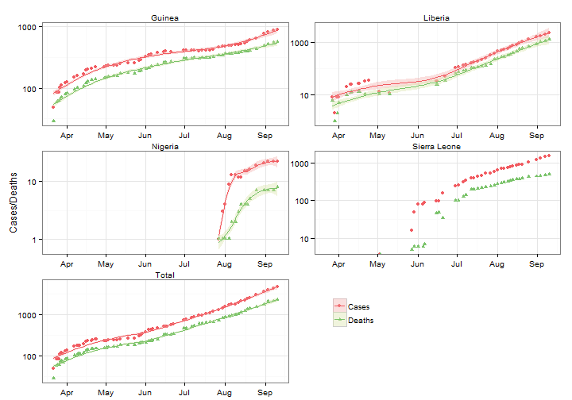
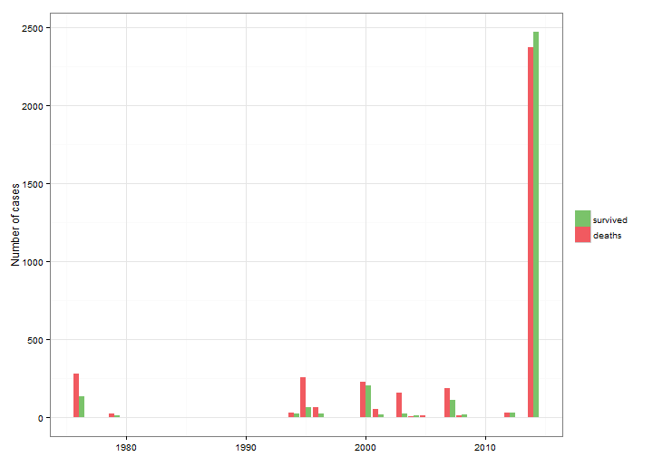

West African 2014 Ebola Outbreak
========================================================
author: 
date: 
transition: rotate

Description of recent Ebola outbreak
========================================================

* Currently on-going outbreak began in Guinea in December 2013.
* Has now spread to neighboring countries Liberia, Sierra Leone, Nigeria, and Senegal.
* Largest outbreak of Ebola since its discovery in 1976. 
* More than 5,200 suspected cases and more than 2,600 deaths.

Rate of growth
========================================================

The number of people infected has been growing at a nearly exponential rate.
 

Comparison with earlier outbreaks
========================================================

The recent outbreak is much larger than earlier outbreaks, but the mortality rate has been lower.

 

Why use this app?
========================================================
* Acquiring data on the outbreak is not trivial; the WHO does not offer downloads of e.g. CSV files.
* Consequently, data was scraped off the Wikipedia site on the outbreak. 
* This procedure is fully reproducible and would allow an app such as this to serve as a source of up-to-date 
information on the spread of the virus.

Further resources
========================================================

* [Wikipedia article (source of data scrape)](en.wikipedia.org/wiki/Ebola_virus_epidemic_in_West_Africa)
* [World Health Organization](www.who.int/csr/disease/ebola/en/)
* [WHO Regional Office for Africa](http://www.afro.who.int/en/clusters-a-programmes/dpc/epidemic-a-pandemic-alert-and-response/outbreak-news.html)
* [United States Centers for Disease Control and Prevention](www.cdc.gov/vhf/ebola/outbreaks/guinea/)
